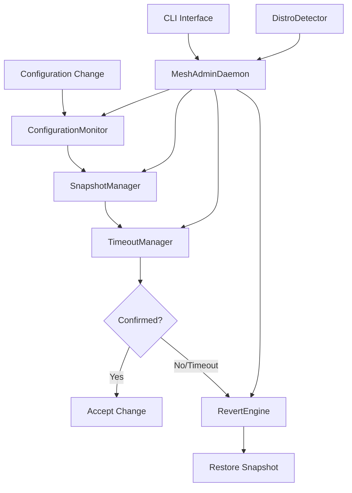
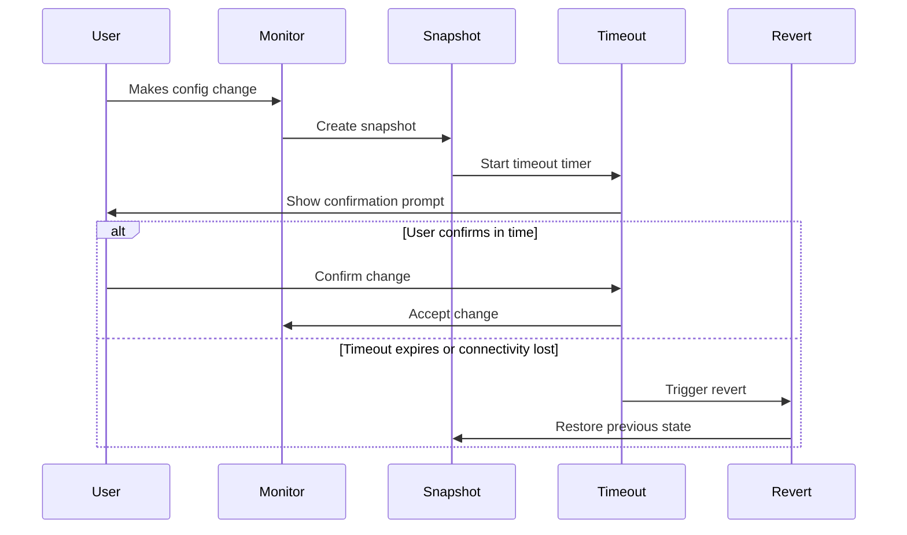

# 🔄 MeshAdmin Revert-IT

> 🛡️ A timed confirmation system for (Li)nux configuration changes with automatic revert capabilities. Designed for remote system administrators to prevent loss of access due to configuration errors.

---

## 📋 Overview

MeshAdmin Revert-IT monitors critical system configuration files and enforces timed confirmations for any changes. If changes are not confirmed within the specified timeout period, or if connectivity is lost, the system automatically reverts to the previous configuration using snapshots.

## ✨ Key Features

| Feature | Description |
|---------|-------------|
| 🔍 **Automatic Configuration Monitoring** | Watches critical system files (network, SSH, firewall, services) |
| ⏰ **Timed Confirmation System** | Requires explicit confirmation of changes within configurable timeouts |
| 🔄 **Automatic Revert** | Reverts changes if not confirmed or if connectivity is lost |
| 📸 **TimeShift Integration** | Uses TimeShift for system-level snapshots when available |
| 🐧 **Multi-Distribution Support** | Works with Ubuntu, Debian, CentOS, RHEL, Fedora, and more |
| 🌐 **Connectivity Checking** | Tests network connectivity before performing reverts |
| ⚙️ **Flexible Configuration** | Customizable timeouts, paths, and behaviors per change type |

---

## 🏗️ Architecture



## 🧩 Core Components

| Component | Purpose |
|-----------|---------|
| 🔧 **MeshAdminDaemon** | Main service that monitors system changes |
| 👁️ **ConfigurationMonitor** | Watches critical system files using filesystem events |
| 📸 **SnapshotManager** | Manages system snapshots (TimeShift integration + manual snapshots) |
| ⏱️ **TimeoutManager** | Handles timed confirmations and automatic reverts |
| 🔄 **RevertEngine** | Performs automatic reversion of configuration changes |
| 🐧 **DistroDetector** | Detects Linux distribution and provides compatibility information |
| 💻 **CLI Interface** | Command-line tools for management |

## 🔄 How It Works



---

## 🚀 Installation

### 📋 Prerequisites
- 🐧 Linux system with systemd (Ubuntu 18.04+, Debian 10+, CentOS 7+, RHEL 7+, Fedora 28+)
- 🐍 Python 3.8 or higher
- 👑 Root privileges for installation and operation
- 📸 TimeShift (optional & recommended, for enhanced snapshot capabilities)

### ⚡ Quick Install

```bash
# 📥 Clone the repository
git clone https://github.com/meshadmin/meshadmin-revertit.git
cd meshadmin-revertit

# 🚀 Run installation script
sudo ./scripts/install.sh
```

### 🔧 Manual Installation

```bash
# 📦 Install system dependencies
sudo apt update && sudo apt install python3-pip python3-dev build-essential rsync inotify-tools

# 🐍 Install Python package
sudo pip3 install -e .

# 📁 Create directories
sudo mkdir -p /etc/meshadmin-revertit /var/lib/meshadmin-revertit

# ⚙️ Copy configuration
sudo cp config/meshadmin-revertit.yaml /etc/meshadmin-revertit/config.yaml

# 🔧 Install systemd service
sudo cp systemd/meshadmin-revertit.service /etc/systemd/system/
sudo systemctl daemon-reload
```

---

## ⚙️ Configuration

> 📍 The main configuration file is located at `/etc/meshadmin-revertit/config.yaml`.

### 🔑 Key Configuration Options

```yaml
# 🌐 Global settings
global:
  default_timeout: 300        # ⏰ Default timeout (5 minutes)
  max_timeout: 1800          # ⏰ Maximum timeout (30 minutes)
  log_level: INFO
  log_file: /var/log/meshadmin-revertit.log

# 📸 Snapshot settings
snapshot:
  enable_timeshift: true
  snapshot_location: /var/lib/meshadmin-revertit/snapshots
  max_snapshots: 10

# 👁️ Monitoring paths
monitoring:
  network_configs:
    - /etc/network/interfaces
    - /etc/netplan/*.yaml
    - /etc/NetworkManager/system-connections/*
  
  ssh_configs:
    - /etc/ssh/sshd_config
    - /etc/ssh/ssh_config.d/*
  
  firewall_configs:
    - /etc/iptables/rules.v4
    - /etc/ufw/*

# ⏱️ Timeout behavior
timeout:
  timeout_action: revert
  connectivity_check: true
  connectivity_endpoints:
    - 8.8.8.8
    - 1.1.1.1
  revert_grace_period: 30
```

---

## 💻 Usage

### 🚀 Starting the Service

```bash
# ✅ Enable and start the service
sudo systemctl enable meshadmin-revertit
sudo systemctl start meshadmin-revertit

# 📊 Check status
sudo systemctl status meshadmin-revertit
```

### 🖥️ Command Line Interface

```bash
# 📊 Show system status
meshadmin-revertit status

# ⏰ List active timeouts
meshadmin-revertit timeouts

# ✅ Confirm a configuration change
meshadmin-revertit confirm <change-id>

# 📸 Manage snapshots
meshadmin-revertit snapshots list
meshadmin-revertit snapshots create --description "Manual backup before major changes"

# 🧪 Test system compatibility
meshadmin-revertit test
```

### 📝 Example Workflow

```mermaid
flowchart LR
    A[🔧 Make Config Change] --> B[🔍 System Detects Change]
    B --> C[📸 Create Snapshot]
    C --> D[⏰ Start Timeout]
    D --> E[⚠️ Show Warning]
    E --> F{User Action?}
    F -->|✅ Confirm| G[✅ Accept Change]
    F -->|⏰ Timeout/Lost Connection| H[🔄 Auto-Revert]
```



1. **🔧 Make a configuration change** (e.g., edit `/etc/ssh/sshd_config`)
2. **🔍 System detects change** and creates a snapshot
3. **⏰ Timeout starts** (default 5 minutes for SSH changes)
4. **⚠️ System shows warning** about pending timeout
5. **✅ Confirm the change**: `meshadmin-revertit confirm ssh_1234567890`
6. **🔄 Or let it auto-revert** if you lose connectivity or forget to confirm

### ⏰ Change Categories and Timeouts

| Category | Files | Timeout |
|----------|-------|---------|
| 🌐 **Network** | `/etc/network/*`, `/etc/netplan/*` | 10 minutes |
| 🔐 **SSH** | `/etc/ssh/*` | 15 minutes |
| 🛡️ **Firewall** | `/etc/iptables/*`, `/etc/ufw/*` | 5 minutes |
| 🔧 **Services** | `/etc/systemd/system/*` | 5 minutes |
| 📁 **Other** | Various system files | 5 minutes |

---

## 🛡️ Safety Features

### 🌐 Connectivity Checking
Before reverting network changes, the system tests connectivity to configured endpoints (8.8.8.8, 1.1.1.1, google.com by default).

### ⏳ Grace Period
A configurable grace period (default 30 seconds) is provided before performing reverts, allowing for last-minute confirmations.

### 📸 Snapshot Management
- 🧹 **Automatic cleanup** of old snapshots
- 🔗 **Integration with TimeShift** for system-level snapshots
- 🎯 **Manual snapshot creation** and restoration
- 🗜️ **Compressed snapshots** to save disk space

### 🔧 Default Configurations
When snapshots are unavailable, the system can restore sensible default configurations for critical services.

---

## 🐧 Distribution Support

### ✅ Full Support

| Distribution | Versions |
|--------------|----------|
| 🟠 **Ubuntu** | 18.04, 20.04, 22.04, 24.04 |
| 🔴 **Debian** | 10, 11, 12 |
| 🟡 **CentOS** | 7, 8, 9 |
| 🔴 **RHEL** | 7, 8, 9 |
| 🔵 **Fedora** | 32+ |

### 🧪 Experimental Support
- 🔵 Arch Linux
- 🟢 openSUSE
- 🏔️ Alpine Linux
- 🪟 Windows WSL
- 🍎 MacOS (Coming Soon!)
- 🪟 Windows OS (Planned)

### 🔧 Distribution-Specific Features
- 📦 **Automatic detection** of package managers (apt, yum, dnf, pacman)
- 🔧 **Service management** system detection (systemd, SysV)
- 🌐 **Network configuration** system detection (netplan, NetworkManager, interfaces)
- 🛡️ **Firewall system** detection (ufw, firewalld, iptables)

---

## 📊 Logging and Monitoring

### 📝 Log Files
- 📄 **Main log**: `/var/log/meshadmin-revertit.log`
- 🔄 **Automatic log rotation** configured
- 📋 **Structured logging** with timestamps and severity levels

### 📊 Log Levels

| Level | Description |
|-------|-------------|
| 🔍 **DEBUG** | Detailed operation information |
| ℹ️ **INFO** | General operation status |
| ⚠️ **WARNING** | Timeout warnings and non-critical issues |
| ❌ **ERROR** | Errors during operation |
| 🚨 **CRITICAL** | Critical failures requiring attention |

### 📢 Notifications
- 📋 **Syslog integration** for system logs
- 🖥️ **Desktop notifications** (when GUI available)
- 📧 **Email notifications** (configurable)

---

## 🔒 Security Considerations

### 👑 Permissions
- 🔐 **Runs as root** (required for system configuration management)
- 📁 **Configuration files** are root-owned and protected
- 🛡️ **Snapshot directories** have restricted permissions

### 🌐 Network Security
- 🔒 **Minimal network exposure** (only outbound connectivity checks)
- 🚫 **No remote management** interfaces by default
- 🏠 **All operations** are local to the system

### 📸 Snapshot Security
- ⚠️ **Snapshots may contain** sensitive configuration data
- 🧹 **Automatic cleanup** prevents accumulation of old snapshots
- 🔐 **Snapshots are stored** in protected directories

---

## 🔧 Troubleshooting

### ❓ Common Issues

#### 🚫 Service won't start

```bash
# 📊 Check service status and logs
sudo systemctl status meshadmin-revertit
sudo journalctl -u meshadmin-revertit -f

# 🧪 Test configuration
meshadmin-revertit test
```

#### 📸 TimeShift not working

```bash
# 📦 Install TimeShift
sudo apt install timeshift  # Ubuntu/Debian

# ⚙️ Configure TimeShift
sudo timeshift --list
```

#### 🔐 Permissions errors

```bash
# 🔧 Ensure proper permissions
sudo chown -R root:root /etc/meshadmin-revertit
sudo chmod 644 /etc/meshadmin-revertit/config.yaml
```

### 🐛 Debug Mode

```bash
# 🔍 Run in foreground with debug logging
sudo meshadmin-daemon --config /etc/meshadmin-revertit/config.yaml --foreground
```

---

## 👨‍💻 Development

### 📋 Requirements
- 🐍 Python 3.8+
- 📦 pip packages: `psutil`, `watchdog`, `pyyaml`, `croniter`

### 🛠️ Development Setup

```bash
# 📥 Clone repository
git clone https://github.com/meshadmin/meshadmin-revertit.git
cd meshadmin-revertit

# 🔧 Install in development mode
pip3 install -e .

# 🧪 Run tests
python -m pytest tests/

# 🔍 Run linting
flake8 src/
black src/
mypy src/
```

### 📁 Project Structure

```
MeshAdminRevertIt/
├── 📦 src/meshadmin_revertit/     # Main package code
│   ├── 🔧 daemon/                 # Daemon implementation
│   ├── 📸 snapshot/               # Snapshot management
│   ├── 👁️ monitor/                # Configuration monitoring
│   ├── ⏰ timeout/                # Timeout management
│   ├── 🔄 revert/                 # Revert engine
│   ├── 🐧 distro/                 # Distribution detection
│   └── 💻 cli/                    # Command-line interface
├── ⚙️ config/                     # Default configuration
├── 🔧 systemd/                    # systemd service files
├── 📜 scripts/                    # Installation scripts
├── 🧪 tests/                      # Test suite
└── 📚 docs/                       # Documentation
```

---

## 🤝 Contributing    

1. 🍴 **Fork** the repository
2. 🌿 **Create** a feature branch
3. ✏️ **Make** your changes
4. 🧪 **Add tests** for new functionality
5. ✅ **Ensure** all tests pass
6. 📤 **Submit** a pull request

---

## 📄 License    

📜 **MIT License** - see [LICENSE](LICENSE) file for details.

---

## 🆘 Support

| Type | Contact |
|------|---------|
| 🐛 **Issues** | [GitHub Issues](https://github.com/meshadmin/meshadmin-revertit/issues) |
| 📚 **Documentation** | See [docs/](docs/) directory |
| 🔒 **Security Issues** | Please report privately to info@meshadmin.com |

---

## 🙏 Acknowledgments      

- 📸 **TimeShift project** for inspiration and integration
- 🐧 **The Linux community** for excellent monitoring tools
- 👥 **All contributors** and users providing feedback

---

## ⭐ Star this project if you find it useful!

[](https://github.com/meshadmin/meshadmin-revertit/stargazers)
[](https://github.com/meshadmin/meshadmin-revertit/network/members)
[](https://github.com/meshadmin/meshadmin-revertit/issues)
